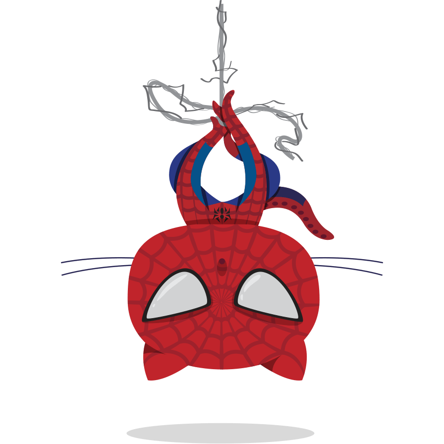

<div>
    
</div>

# About Me
- 👋 Hi, I’m @daolivar
- 👀 I’m interested in Software Development 💻, Basketball 🏀, Spider-Man 🕷 and Pandas 🐼
- 🌱 I’m currently learning:
    - 
    - 
    - 
    - 
- 💞️ I’m looking to collaborate on open source projects big and small

## Technical Details
```go
package main

import "fmt"

type David struct {
	name      string
	employer  string
	role      string
	exp       int
	edu       string
	languages []string
	tools     []string
}

func CreateDavid() *David {
	d := David{
		name:      "David Olivares",
		employer:  "Visa",
		role:      "Senior Software Engineer",
		exp:       2,
		edu:       "California State University, Monterey Bay",
		languages: []string{"Go", "C++", "Java", "HTML", "CSS", "Javascript"},
		tools:     []string{"Git", "Docker", "Jira", "Jenkins", "Bootstrap", "Postman", "Chrome Dev Tools"},
	}
	return &d
}

func main() {
	daolivar := CreateDavid()
	fmt.Printf("%#v\n", daolivar)
}
```

<div align="center">
	
</div>

<div align="center">
	
</div>
